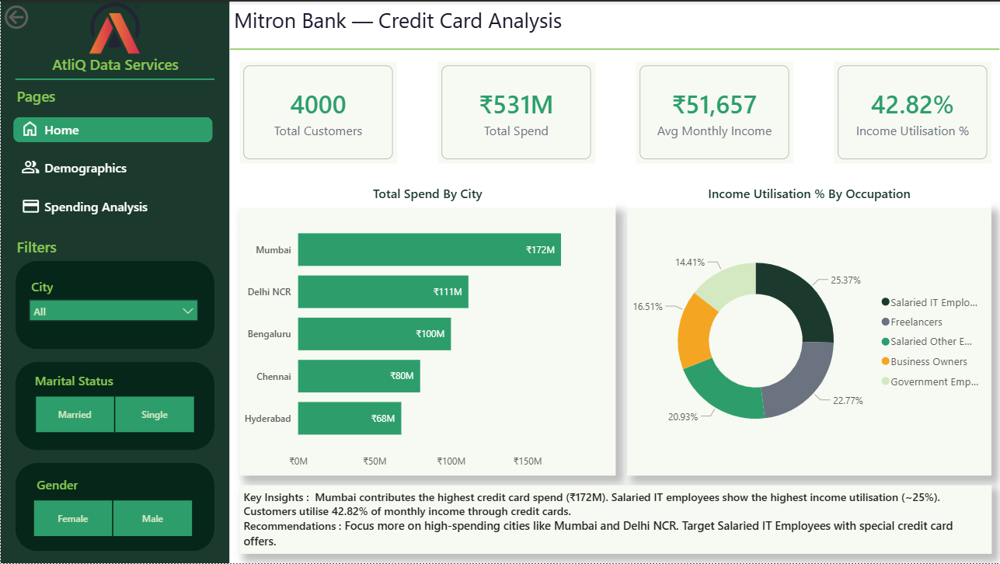
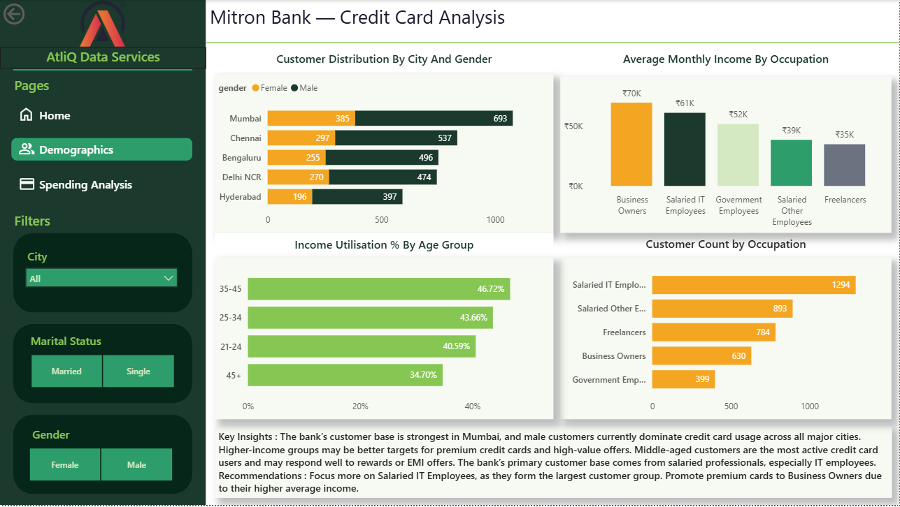
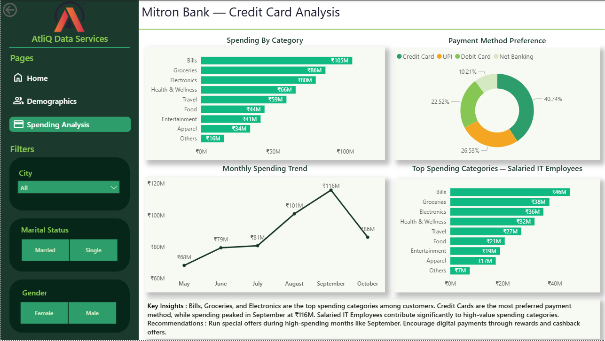

# 🏦 Mitron Bank Credit Card Analysis

## 📌 Project Overview

This project was completed as part of the **@codebasics Resume Project Challenge**.

Mitron Bank plans to launch a new credit card product and wants to understand customer spending behaviour, income patterns, and payment preferences before making business decisions.

The goal of this project is to analyze customer demographics and transaction data to identify high-value customer segments and provide data-driven business recommendations.

---

# 🎯 Business Problem

Mitron Bank needed insights to answer questions such as:

* Which customer segments spend the most?
* Which cities contribute the highest revenue?
* What are the most popular spending categories?
* Which occupations and age groups show higher income utilisation?
* What type of credit card features should the bank introduce?

---

# 🛠️ Tools & Technologies Used

* **MySQL** → Data analysis using SQL queries
* **Power BI** → Interactive dashboard creation
* **Power Query** → Data cleaning & transformation

---

# 📊 Dashboard Pages

## 1️⃣ Home Page

Provides an overall business overview including:

* Total Customers
* Total Spend
* Average Monthly Income
* Income Utilisation %
* Total Spend by City
* Income Utilisation by Occupation

### Key Insights

* Mumbai recorded the highest credit card spending.
* Salaried IT Employees showed the highest income utilisation.
* Customers utilised 42.82% of their monthly income through credit card spending.

### Recommendations

* Focus marketing campaigns on high-spending cities like Mumbai and Delhi NCR.
* Target Salaried IT Employees with personalized credit card offers.

---

## 2️⃣ Demographics Page

Analyzes customer distribution across:

* City
* Gender
* Occupation
* Age Group

### Key Insights

* Salaried IT Employees formed the largest customer segment.
* Business Owners had the highest average monthly income.
* Customers aged 35–45 showed the highest income utilisation.

### Recommendations

* Promote premium credit cards to high-income customer groups.
* Create targeted offers for highly active customer segments.

---

## 3️⃣ Spending Analysis Page

Focuses on customer spending behaviour:

* Spending by Category
* Payment Method Preference
* Monthly Spending Trend
* Top Spending Categories for IT Employees

### Key Insights

* Bills, Groceries, and Electronics were the top spending categories.
* Credit Cards were the most preferred payment method.
* Customer spending peaked during September.

### Recommendations

* Launch seasonal campaigns during peak spending periods.
* Introduce cashback and rewards for high-spending categories.

---

# 💡 Business Recommendations

Based on the analysis, Mitron Bank can:

* Target Salaried IT Employees as a primary customer segment
* Increase focus on high-performing cities
* Offer category-based cashback programs
* Introduce festive season reward campaigns
* Design premium cards for high-income customers

---

# 📚 What I Learned

* Building an end-to-end data analytics project
* Creating business-focused dashboards
* Writing optimized SQL queries
* Transforming raw data into actionable insights
* Applying storytelling techniques in Power BI

---

# 🔗 Project Links

Power BI Dashboard: [https://app.powerbi.com/view?r=eyJrIjoiN2I2YWM5YmYtYzA1MS00NWUyLTk4NzgtMTk2MmMwMjdkMDIxIiwidCI6ImM2ZTU0OWIzLTVmNDUtNDAzMi1hYWU5LWQ0MjQ0ZGM1YjJjNCJ9]

---

# 📷 Dashboard Snapshots

## Home Page

## Demographics Page

## Spending Analysis Page

